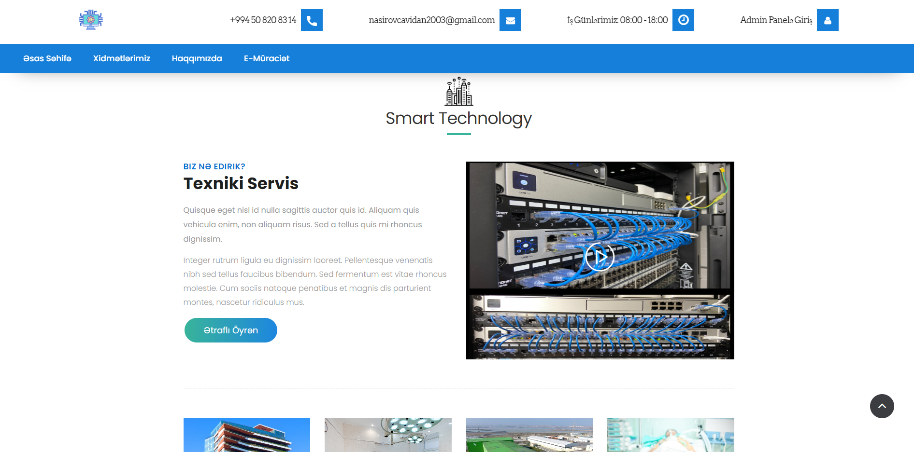
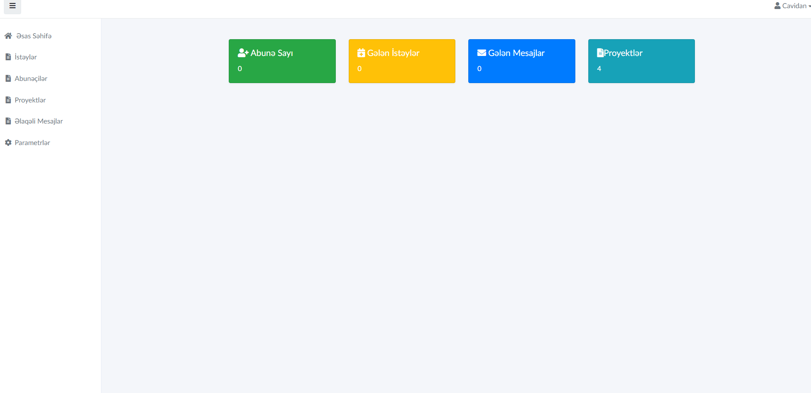
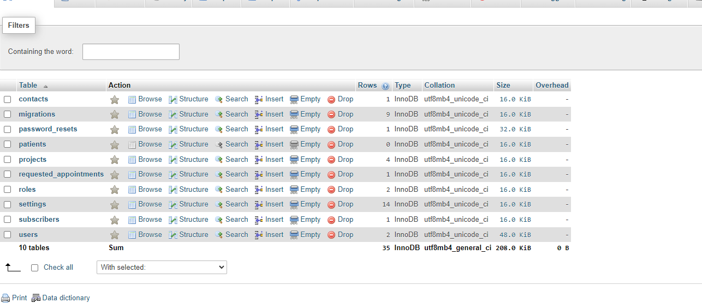

# Smart Technology


## Front End



## Back End



## Database Tables



## Installation

Layihəni Maşınınızda yerli olaraq qurmaq və işə salmaq üçün bu təlimatlara əməl edin.


### Installation

1. Clone the repository:

```bash
   git clone https://github.com/Cavidan03/Smart_Technology.git
```
 ```bash
   cd Smart_Technology
```

 ```bash
composer install
```
 ```bash
cp .env.example .env
```
```bash
php artisan key:generate
 ```
```bash
php artisan storage:link
```
 ```bash
 php artisan migrate:fresh --seed
```
 ```bash
 php artisan serve
```

## Admin Credentials
Admin: 
```bash 
nasirovcavidan@gmail.com
```
Password: 
```bash
Cavidan_2003
```

## If you like our project please leave a star ❤

